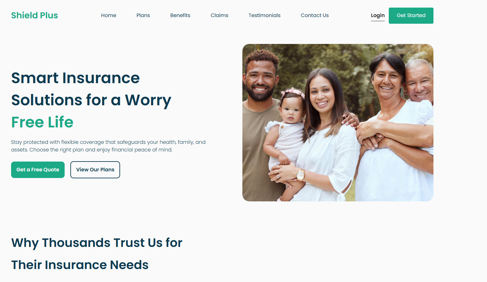

# Landing Page Shield Plus

## Autor : Ernesto Almazan.

## Descripción del Proyecto

Esta es una landing page de ejemplo diseñada para poner en practica mis conocimientos en el desarollo front end. 

## Tecnologías Utilizadas

En la construcción de esta landing page se utilizaron las siguientes tecnologías:

* **HTML5:** Para la estructura y el contenido de la página.
* **CSS3:** Para el diseño, la presentación y los estilos y diseño responsivo.
* **Bootstrap v5:** Para añadir componentes de ui.

## Instrucciones para Correr o Visualizar la Landing Page

**1. Directamente desde el navegador (si solo utiliza HTML, CSS y JavaScript estático):**

* Descarga o clona este repositorio.
* Navega hasta la carpeta donde se encuentra el archivo `index.html`.
* Haz doble clic en el archivo `index.html`. Esto abrirá la landing page en tu navegador web predeterminado.

**url para visualizar el proyecto desplegado en netlify : https://dev-almazan-test-lp.netlify.app/ ** .
